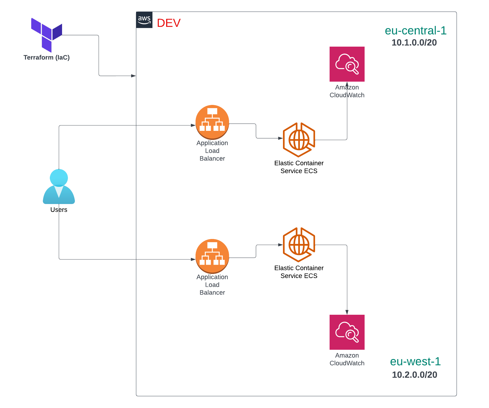

# 🚀 Jsonnet + Terraform Integration Example

Welcome to the **Jsonnet + Terraform Integration Example Project**! This repository demonstrates how to integrate [Terraform](https://www.terraform.io/) with [Jsonnet](https://jsonnet.org/) to define and manage cloud infrastructure configurations.

---

## 📖 Table of Contents

- [About the Project](#-about-the-project)
- [What is Jsonnet?](#-what-is-jsonnet)
- [Pros and Cons of Using Jsonnet with Terraform](#-pros-and-cons-of-using-jsonnet-with-terraform)
- [Getting Started](#-getting-started)
- [Important Tips](#-important-tips)
- [License](#-license)

---

## 🛠 About the Project

This project uses **Terraform** to manage AWS infrastructure and **Jsonnet** to define infrastructure configuration in a structured, reusable and readable format. It aims to provide an example for those who want to **learn** and **experiment** with Jsonnet.


It is a small project that demonstrates the deployment of a very basic AWS infrastructure hosted on **Fargate** using **Spot Instances**. The key components of the infrastructure include:

- **VPC**
- **Load Balancer**
- **Elastic Container Service**
- **CloudWatch Groups**
- **IAM Roles and Policies**

The infrastructure can be deployed in **two accounts** and **two regions** with the option to easily scale to support additional accounts or regions if needed.

Below is the AWS infrastructure diagram for this project:



---

## 🤔 What is Jsonnet?

[Jsonnet](https://jsonnet.org/) is a powerful data templating language designed to overcome the limitations of standard JSON. Think of it as a **smarter JSON** that supports variables, conditionals, functions, arithmetic operations, imports and error propagation to simplify complex configurations.

### Why Choose Jsonnet?:
- **Dynamic Configuration**: Supports the dynamic generation of configuration data, making it a great choice for modern platforms and tools such as Kubernetes, Terraform, Grafana dashboards, Prometheus configurations and many more.
- **Reduce Repetition**: Reuse JSON snippets without copying and pasting to minimize errors and ensure maintainability.
- **Improved Readability**: Enhances the clarity and organization of JSON data by allowing comments and supporting structured programming constructs.

---

## ✅ Pros and Cons of Using Jsonnet with Terraform

### Pros:
- **Dynamic Configuration**: Reduce boilerplate and repetitive tasks using Jsonnet's programming capabilities.
- **Improved Maintainability**: Modular and reusable Jsonnet code allows for clean and maintainable infrastructure configurations.
- **Readable Output**: Jsonnet generates standard JSON which is universally understood and directly compatible with Terraform.
- **Flexibility**: Ideal for large-scale dynamic infrastructure projects requiring variations in configuration.
- **Ease of Collaboration**: Using Jsonnet makes it easier for Developers and other teams to understand, contribute to and extend configurations effectively.

### Cons:
- **Learning Curve**: Jsonnet introduces an additional tool to learn, which might be unfamiliar to those comfortable with HCL.
- **Tooling Overhead**: Requires an extra step of generating JSON files from Jsonnet before deployment.
- **Debugging Complexity**: Errors may arise in the Jsonnet-to-Terraform translation, adding complexity to troubleshooting.

---

## 🔧 Getting Started

### Prerequisites:
- [Terraform](https://www.terraform.io/downloads.html) installed.
- [Jsonnet](https://github.com/google/go-jsonnet/releases) installed.
- [AWS CLI](https://docs.aws.amazon.com/cli/latest/userguide/getting-started-install.html) installed and configured for authentication.

### Steps:
1. **Clone this repository**
   ```bash
   git clone https://github.com/johnbasteas/jsonnet-with-terraform.git

2. **Modify Jsonnet Configurations**  
   Navigate to the **jsonnet/config/test-lab** directory and modify `dev.libsonnet` or `qa.libsonnet` files according to your infrastructure needs.

3. **Generate JSON Files**  
   Navigate to the **jsonnet/scripts** directory and run the `gen_config.sh` script to generate the **.json** files.
   > ./gen_config.sh

4. **Terraform Init**  
   Navigate to **terraform** directory and run the following command to initialize the Terraform working directory.
   > terraform init

4. **Terraform Plan**  
   From the same directory execute the following command to review the planned changes.
   > terraform plan -var-file="../jsonnet/generated/test-lab/dev.json"

5. **Terraform apply**  
   Execute the following command to apply the changes and provision the infrastructure:
   > terraform apply -var-file="../jsonnet/generated/test-lab/dev.json"

---

## 📌 Important Tips

Here are some best practices and recommendations to keep in mind:

### 1. **Separate Repositories for Jsonnet and Terraform**
- It is best practice to have dedicated repositories for **Jsonnet** and **Terraform**, this ensures:
  - Improved team collaboration by decoupling the configuration templates from the infrastructure code.
  - Better version control.
  - Enhanced Security and Access Control.

### 2. **Follow GitOps Practices**
- To adopt GitOps principles implement a pipeline that:
  - Generates the JSON files from the Jsonnet repository by running a script such as **gen_config.sh**.
  - Commits the JSON files automatically to the Jsonnet repository.
  - Checkout the Jsonnet repository from your **Terraform repository**.
  - Create a multi-stage pipeline using the appropriate TF commands, specifying the environment file (e.g., dev.json, qa.json) that matches your deployment needs.

---

## 📝 License

This project is licensed under the [MIT License](LICENSE).
